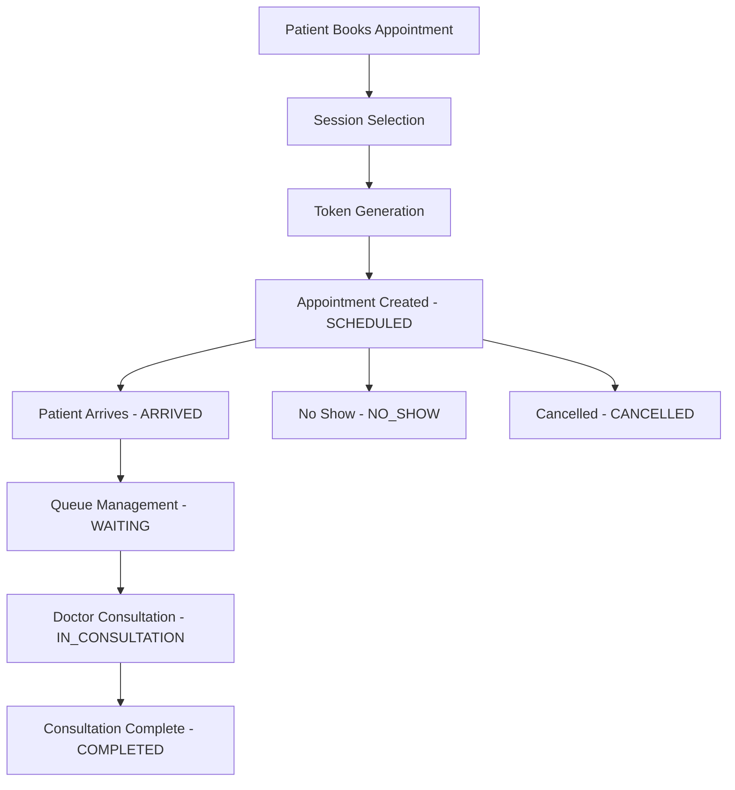
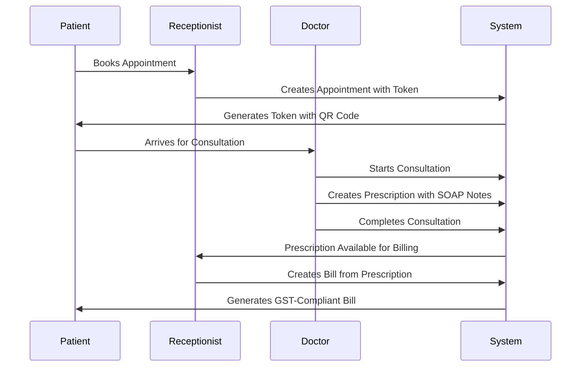

# Feature Specifications

## Core Features Overview

### 1. User Authentication & Role Management

#### Authentication System

- **Technology**: NextAuth.js with JWT strategy
- **Supported Methods**: Email/Password credentials
- **Session Management**: JWT tokens with configurable expiration
- **Password Security**: bcrypt hashing with salt rounds

#### Role-Based Access Control

```typescript
enum UserRole {
  ADMIN = "ADMIN",
  DOCTOR = "DOCTOR",
  RECEPTIONIST = "RECEPTIONIST",
}

interface RolePermissions {
  [UserRole.ADMIN]: {
    patients: ["create", "read", "update", "delete"];
    appointments: ["create", "read", "update", "delete"];
    billing: ["create", "read", "update", "delete"];
    reports: ["read"];
    settings: ["read", "update"];
    users: ["create", "read", "update", "delete"];
  };
  [UserRole.DOCTOR]: {
    patients: ["read"];
    appointments: ["read", "update"];
    prescriptions: ["create", "read", "update"];
    consultations: ["create", "read", "update"];
  };
  [UserRole.RECEPTIONIST]: {
    patients: ["create", "read", "update"];
    appointments: ["create", "read", "update"];
    billing: ["create", "read", "update"];
    queue: ["read", "update"];
  };
}
```

#### User Management Features

- User registration with role assignment
- Profile management
- Password reset functionality (planned)
- Account activation/deactivation
- Last login tracking

### 2. Patient Management System

#### Patient Registration

- **Comprehensive Demographics**: Name, contact, DOB, gender, address
- **Medical Information**: Blood group, allergies, emergency contacts
- **Identification**: Multiple ID proof types support
- **Unique Identifier**: Phone number as primary identifier
- **Data Validation**: Real-time validation with error feedback

#### Patient Search & Filtering

```typescript
interface PatientSearchFilters {
  name?: string;
  phone?: string;
  email?: string;
  dateOfBirth?: DateRange;
  gender?: "MALE" | "FEMALE" | "OTHER";
  bloodGroup?: string;
  registrationDate?: DateRange;
}

interface PatientSearchResult {
  patients: Patient[];
  pagination: PaginationInfo;
  totalCount: number;
  filters: AppliedFilters;
}
```

#### Patient History Tracking

- Appointment history with outcomes
- Prescription records
- Billing history
- Vital signs tracking
- Medical notes and observations

### 3. Token-Based Appointment System

#### Session Management

```typescript
interface AppointmentSession {
  id: string;
  date: Date;
  name: string; // "Morning", "Afternoon", "Evening", "Late Eve"
  shortCode: string; // "M", "N", "E", "LE"
  startTime: string; // "09:00"
  endTime: string; // "13:00"
  maxTokens: number;
  currentTokens: number;
  isActive: boolean;
}
```

#### Token Generation System

- **Format**: `{tokenPrefix}-{sessionShortCode}-{sequentialNumber}`
- **Example**: `MED-M-001`, `MED-E-025`
- **Sequential Numbering**: Auto-increment within session
- **QR Code Integration**: Embedded appointment details
- **Print Support**: Professional token design with hospital branding

#### Appointment Workflow



#### Priority System

- **EMERGENCY**: Immediate attention, bypasses queue
- **HIGH**: Urgent but not emergency
- **NORMAL**: Standard appointment priority
- **LOW**: Non-urgent consultation

### 4. Doctor Dashboard & Queue Management

#### Real-Time Queue Display

```typescript
interface QueueItem {
  appointment: Appointment;
  patient: Patient;
  tokenNumber: string;
  priority: Priority;
  status: AppointmentStatus;
  waitTime: number; // in minutes
  estimatedTime: number; // estimated consultation time
}

interface QueueStats {
  totalWaiting: number;
  averageWaitTime: number;
  completedToday: number;
  emergencyCount: number;
}
```

#### Consultation Management

- Start/pause/complete consultation tracking
- Actual time vs estimated time recording
- Patient history quick access
- Prescription creation integration
- SOAP notes documentation

#### Doctor Availability Management

```typescript
interface DoctorAvailability {
  type: "UNAVAILABLE" | "LEAVE" | "HOLIDAY" | "CUSTOM";
  startDate: Date;
  endDate?: Date;
  startTime?: string;
  endTime?: string;
  weekdays?: number[]; // [1,2,3] for recurring
  reason?: string;
  isRecurring: boolean;
}
```

### 5. Prescription Management with SOAP Notes

#### SOAP Documentation Structure

```typescript
interface SOAPNotes {
  subjective: {
    chiefComplaint: string;
    historyOfPresentIllness: string;
    symptoms: string[];
    patientConcerns: string;
  };
  objective: {
    vitalSigns: VitalSigns;
    physicalExamination: string;
    labResults?: string;
    diagnosticTests?: string;
  };
  assessment: {
    primaryDiagnosis: string;
    differentialDiagnosis: string[];
    clinicalImpression: string;
  };
  plan: {
    treatment: string;
    medications: Medicine[];
    followUpInstructions: string;
    referrals?: string;
    patientEducation: string;
  };
}
```

#### Medicine Management

```typescript
interface Medicine {
  name: string;
  genericName?: string;
  dosage: string; // "500mg"
  frequency: string; // "Twice daily"
  duration: string; // "5 days"
  instructions: string; // "After meals"
  category?: string;
  manufacturer?: string;
}

interface PrescriptionItem {
  medicine: Medicine;
  quantity: number;
  substitutionAllowed: boolean;
  specialInstructions?: string;
}
```

#### Quick Selection Tools

- Common symptoms checklist
- Vital signs input templates
- Frequent diagnoses shortcuts
- Medicine search with autocomplete
- Dosage calculation helpers

### 6. GST-Compliant Billing System

#### Bill Structure

```typescript
interface Bill {
  billNumber: string; // Auto-generated sequential
  patient: Patient;
  doctor: User;
  appointment?: Appointment;
  prescription?: Prescription;

  items: BillItem[];

  // Financial calculations
  subtotal: number;
  cgst: number; // Central GST
  sgst: number; // State GST
  igst?: number; // Integrated GST (inter-state)
  discountAmount: number;
  finalAmount: number;

  // Payment tracking
  paymentStatus: PaymentStatus;
  paymentMethod?: PaymentMethod;
  paidAmount: number;
  balanceAmount: number;

  // Metadata
  createdBy: User;
  notes?: string;
  createdAt: Date;
}
```

#### GST Calculation Logic

```typescript
const calculateGST = (
  amount: number,
  gstRate: number,
  isInterState: boolean = false,
) => {
  const gstAmount = (amount * gstRate) / 100;

  if (isInterState) {
    return {
      cgst: 0,
      sgst: 0,
      igst: gstAmount,
    };
  } else {
    return {
      cgst: gstAmount / 2,
      sgst: gstAmount / 2,
      igst: 0,
    };
  }
};
```

#### Bill Item Types

- **CONSULTATION**: Doctor consultation fees
- **MEDICINE**: Prescribed medications
- **LAB_TEST**: Laboratory investigations
- **THERAPY**: Physiotherapy, rehabilitation
- **PROCEDURE**: Medical procedures
- **OTHER**: Miscellaneous charges

#### Payment Processing

```typescript
enum PaymentStatus {
  PENDING = "PENDING",
  PARTIAL = "PARTIAL",
  PAID = "PAID",
  CANCELLED = "CANCELLED",
  REFUNDED = "REFUNDED",
}

enum PaymentMethod {
  CASH = "CASH",
  UPI = "UPI",
  CARD = "CARD",
  CHEQUE = "CHEQUE",
  BANK_TRANSFER = "BANK_TRANSFER",
}
```

### 7. Hospital Configuration System

#### Settings Management

```typescript
interface HospitalSettings {
  // Basic Information
  name: string;
  tagline: string;
  logo?: string;
  phone: string;
  email: string;
  address: string;
  vision: string;
  mission: string;

  // Branding
  primaryColor: string;
  secondaryColor: string;

  // Appointment Configuration
  tokenPrefix: string; // "MED", "HMS"
  sessionPrefix: string; // "S"
  defaultSessionDuration: number; // minutes
  maxTokensPerSession: number;
  allowPublicBooking: boolean;
  requirePatientDetails: boolean;
  autoAssignTokens: boolean;
  enableCarryForward: boolean;

  // Business Hours
  businessStartTime: string; // "09:00"
  businessEndTime: string; // "22:00"
  lunchBreakStart: string; // "13:00"
  lunchBreakEnd: string; // "14:00"

  // Session Templates
  sessionTemplates: SessionTemplate[];

  // Social Media
  socialMedia: {
    facebook?: string;
    twitter?: string;
    instagram?: string;
    linkedin?: string;
  };
}
```

#### Session Template Configuration

```typescript
interface SessionTemplate {
  id: string;
  name: string; // "Morning", "Afternoon"
  shortCode: string; // "M", "N"
  startTime: string; // "09:00"
  endTime: string; // "13:00"
  maxTokens: number;
  isActive: boolean;
  doctorAssignments?: string[]; // Doctor IDs
}
```

### 8. Public Appointment Booking

#### Anonymous Booking Flow

1. **Session Selection**: Choose available time slot
2. **Patient Information**: Provide/update patient details
3. **Appointment Details**: Set priority and notes
4. **Token Generation**: Automatic token assignment
5. **Confirmation**: Print/download token with QR code

#### Patient Registration Integration

```typescript
interface PublicBookingRequest {
  patient: {
    firstName: string;
    lastName: string;
    phone: string; // Primary identifier
    email?: string;
    dateOfBirth?: string;
    gender?: string;
  };
  appointment: {
    sessionId: string;
    type: AppointmentType;
    priority: Priority;
    notes?: string;
  };
}
```

#### Booking Validation

- Session capacity checking
- Duplicate booking prevention
- Patient information validation
- Business hours enforcement

### 9. Reporting & Analytics

#### Dashboard Metrics

```typescript
interface DashboardMetrics {
  today: {
    totalAppointments: number;
    completedConsultations: number;
    pendingAppointments: number;
    revenue: number;
    newPatients: number;
  };
  thisWeek: {
    appointmentTrend: number[];
    revenueTrend: number[];
    patientGrowth: number;
  };
  thisMonth: {
    totalRevenue: number;
    totalPatients: number;
    averageWaitTime: number;
    doctorUtilization: Record<string, number>;
  };
}
```

#### Report Types

- **Patient Demographics**: Age, gender, location distribution
- **Appointment Analytics**: Booking patterns, no-show rates
- **Revenue Reports**: Daily, weekly, monthly financial summaries
- **Doctor Performance**: Consultation times, patient satisfaction
- **Operational Metrics**: Queue efficiency, resource utilization

### 10. Print & Document Generation

#### Token Printing

- Professional token design with hospital branding
- QR code with appointment details
- Priority-based styling (emergency tokens have special highlighting)
- Print and download functionality
- Mobile-responsive design

#### Bill Printing

- GST-compliant bill format
- Hospital letterhead integration
- Itemized billing with tax breakdown
- Payment status indication
- Digital signature support

#### Prescription Printing

- Standard prescription format
- Doctor information and signature
- Medicine list with detailed instructions
- Hospital branding and contact information
- Duplicate copy generation

## Feature Integration Points

### 1. Appointment → Consultation → Prescription → Billing



### 2. Real-Time Updates

- Queue status updates every 30 seconds
- Appointment status changes broadcast to relevant users
- Dashboard metrics refresh automatically
- Notification system for critical events

### 3. Data Synchronization

- Hospital settings sync across all components
- Session templates update appointment booking
- Doctor availability affects appointment scheduling
- Patient updates reflect in all related records

## Future Feature Enhancements

### 1. Advanced Features (Planned)

- **Telemedicine Integration**: Video consultation support
- **Mobile App**: React Native application
- **Offline Support**: Local SQLite synchronization
- **Advanced Analytics**: ML-powered insights
- **Multi-location Support**: Branch management
- **Insurance Integration**: Claim processing
- **Laboratory Integration**: Test result management
- **Pharmacy Integration**: Medicine inventory management

### 2. API Extensions

- **Webhook Support**: Real-time event notifications
- **Third-party Integrations**: EMR systems, payment gateways
- **Mobile API**: Optimized endpoints for mobile apps
- **Bulk Operations**: Mass data import/export
- **Advanced Search**: Elasticsearch integration

### 3. User Experience Enhancements

- **Progressive Web App**: Offline functionality
- **Dark Mode**: Theme customization
- **Accessibility**: WCAG 2.1 compliance
- **Multi-language**: Internationalization support
- **Voice Commands**: Hands-free operation
- **Smart Suggestions**: AI-powered recommendations

This feature specification provides a comprehensive overview of all implemented and planned features, serving as a reference for development, testing, and enhancement activities.
